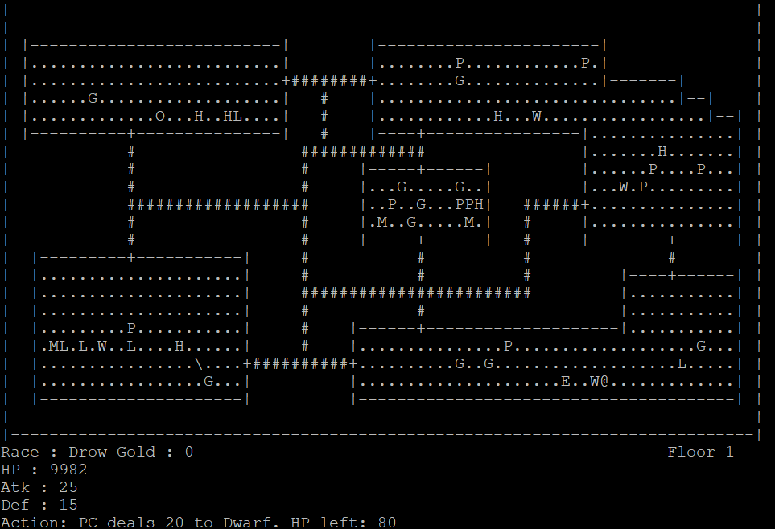

# CC3k

A command-line based dungeon crawler game created for the final project of CS246.

### Features

<u>Playable races</u>
* Shade
* Drow
* Vampire
* Goblin

<u>Enemies</u>
* Human
* Dwarf
* Elf
* Merchant
* Dragon
* Orc
* Halfling

<u>Items</u>
* Restore Health
* Boost Attack
* Boost Defence
* Poison Health
* Wound Attack
* Wound Defence
### Prerequisites

* g++

### Controls

* no,so,ea,we - move north, south, east and west respectively
* u <direction> - use an item in the direction specified
* a <direction> - attack a monster in the direction specified
* q - quit

## Contributors

* Urja Goyal
* Chakshu Shah
* Oscar Elhanafey

